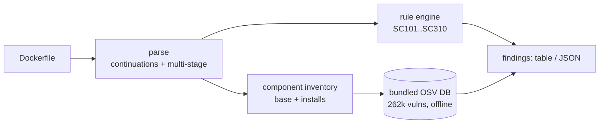

<a name="top"></a>

<div align="center">


# SHIPCHECK

### Offline Dockerfile linter with image-size hygiene + a bundled 262k-vuln CVE database

[](https://pypi.org/project/cognis-shipcheck/) [](https://github.com/cognis-digital/shipcheck/actions) [](https://github.com/cognis-digital/shipcheck/actions/workflows/ports.yml) [](LICENSE) [](https://github.com/cognis-digital)

*Developer & DevSecOps tooling — fast, single-purpose, CI- and agent-friendly. 100% offline, no account, no API key.*

</div>

```bash
pip install cognis-shipcheck
shipcheck lint Dockerfile             # best-practice + size + EOL/CVE advisories
shipcheck vulnmatch Dockerfile        # match base-image packages vs 262k real OSV vulns — offline
```

`shipcheck` reads a Dockerfile, reports prioritized findings, and — with the
bundled offline OSV corpus — tells you which **real CVEs** affect the packages
your base image and `RUN install` steps actually pull in. It never touches the
network: the vulnerability database ships inside the wheel, so it runs the same
on a laptop or in an air-gapped enclave.


<!-- cognis:example:start -->
## 🔎 Example output

Real, reproducible output from the tool — runs offline:

```console
$ shipcheck-emit --version
shipcheck 0.6.4
```

```console
$ shipcheck-emit --help
usage: shipcheck [-h] [--version] {lint,vulnmatch,db,feeds} ...

Dockerfile linter with image-size and CVE advisories.

positional arguments:
  {lint,vulnmatch,db,feeds}
    lint                lint one or more Dockerfiles
    vulnmatch           match a Dockerfile's base-image + installed packages
                        against the bundled offline OSV vulnerability DB (262k
                        real vulns)
    db                  query the bundled offline OSV vulnerability database
    feeds               list / refresh keyless intel feeds for edge & air-gap
                        use

options:
  -h, --help            show this help message and exit
  --version             show program's version number and exit
```

> Blocks above are real `shipcheck` output — reproduce them from a clone.

**Sample result format** _(illustrative values — run on your own data for real findings):_

```
{
"findings": [
    {
        "id": "1234567890",
        "title": "Example Finding 1",
        "description": "This is an example finding.",
        "type": "indicator",
        "spec_version": "2.11.1"
    },
    {
        "id": "2345678901",
        "title": "Example Finding 2",
        "description": "This is another example finding.",
        "type": "attack-pattern",
        "spec_version": "2.11.1"
    }
]
}
```

<!-- cognis:example:end -->

## Contents

- [Why shipcheck?](#why) · [Features](#features) · [Quick start](#quick-start) · [Commands](#commands) · [Worked examples](#examples) · [Offline CVE DB](#cvedb) · [Edge / air-gap](#edge) · [Architecture](#architecture) · [Polyglot ports](#ports) · [AI / MCP](#ai-stack) · [How it compares](#how-it-compares) · [Integrations](#integrations) · [Install anywhere](#install-anywhere) · [Scope & safety](#scope) · [Related](#related) · [Contributing](#contributing)

<a name="why"></a>

## Why shipcheck?

`shipcheck` is single-purpose, scriptable, and self-hostable: point it at a
Dockerfile, get prioritized results in the format your workflow already speaks
(table · JSON), gate CI on the exit code, and let agents drive it over MCP. The
differentiator is the **bundled, offline vulnerability database** — 262,351 real
OSV records across PyPI / npm / Go / Maven / RubyGems / crates.io / NuGet — so
the `vulnmatch` subcommand resolves actual CVEs (yes, including
`CVE-2021-44228` / Log4Shell) the moment you clone the repo, with zero network.

<div align="right"><a href="#top">↑ back to top</a></div>

<a name="features"></a>

## Features

- **Dockerfile linter** — parses continuations + multi-stage builds, then runs a battery of rules across four families:
  - *Security hygiene* — root user (`SC300`), `sudo` in `RUN` (`SC220`), `curl | sh` remote-exec (`SC221`), hard-coded secrets (`SC230`), `ADD` vs `COPY` (`SC240`), SSH port exposure (`SC260`).
  - *Cache / layer efficiency* — `apt-get update` in its own layer (`SC201`), missing `--no-install-recommends` (`SC202`), uncleaned apt lists (`SC203`), `pip` without `--no-cache-dir` (`SC210`), early `COPY . .` (`SC250`), RUN-layer bloat (`SC310`).
  - *Image size* — heavy base images with slimmer variants available (`SC110`).
  - *EOL / CVE advisories* — unpinned / `:latest` tags (`SC101`) and end-of-life base tags (`SC120`).
- **Offline CVE enrichment** (`vulnmatch`) — inventories the packages a Dockerfile actually ships (base-image runtimes + `pip` / `npm` / `gem` / `apt-get install` args) and matches them against the bundled 262k-record OSV DB. Fully offline; no fabricated data.
- **Direct DB queries** (`db`) — `count`, `cve <ID>`, `package <name>`, `search <text>` over the bundled corpus.
- **Edge data feeds** (`feeds`) — a catalog of 35 keyless intel feeds (CISA KEV, EPSS, OSV, NVD, GHSA, MITRE ATT&CK, abuse.ch, OSCAL 800-53 …) with a disk cache and air-gap snapshot transfer for refreshing the corpus on disconnected gear.
- **Outputs** — human table (with severity colors) and machine `--format json`; CI-friendly exit codes.
- **Polyglot ports** — the linter surface in Python (reference), Go, Rust, and Node, each with a smoke test and CI.
- **Runs everywhere** — Linux / macOS / Windows · Docker · devcontainer · CI · MCP.

<div align="right"><a href="#top">↑ back to top</a></div>

<a name="quick-start"></a>

## Quick start

```bash
pip install cognis-shipcheck                 # or: pip install "git+https://github.com/cognis-digital/shipcheck.git"
shipcheck --version

shipcheck lint Dockerfile                    # lint one or more Dockerfiles
shipcheck lint Dockerfile --format json      # machine-readable
shipcheck lint Dockerfile --fail-on high     # CI gate (non-zero exit at >= high)

shipcheck vulnmatch Dockerfile               # offline CVE match for image packages
shipcheck db count                           # -> 262351
shipcheck db cve CVE-2021-44228              # Log4Shell record, offline
```

Exit codes: `0` clean / under threshold · `1` a finding met `--fail-on`
(default `medium`) or `vulnmatch --fail-on-vulns` matched · `2` file/usage error.

<div align="right"><a href="#top">↑ back to top</a></div>

<a name="commands"></a>

## Commands

| Command | What it does |
|---|---|
| `shipcheck lint <Dockerfile>...` | Best-practice / size / EOL advisories. `--format {table,json}`, `--fail-on {info,low,medium,high,critical}`, `--no-color`. |
| `shipcheck vulnmatch <Dockerfile>...` | Inventory image packages and match against the bundled OSV DB. `--format`, `--fail-on-vulns`, `--no-color`. |
| `shipcheck db {count,cve,package,search} [arg]` | Query the bundled 262k-vuln OSV corpus. `--limit`, `--ecosystem`. |
| `shipcheck feeds list [--domain D]` | List the keyless edge/air-gap intel feeds (refresh via `python -m shipcheck.datafeeds`). |
| `shipcheck mcp` | Start an MCP stdio server exposing `shipcheck_scan` (needs the `mcp` extra). |

<div align="right"><a href="#top">↑ back to top</a></div>

<a name="examples"></a>

## Worked examples

**Lint a problematic Dockerfile**

```text
$ shipcheck lint Dockerfile
SHIPCHECK 0.6.4  Dockerfile
  stages=1 instructions=4 findings=5

  L1    CRITICAL SC120  node:12 - EOL: Node 12 is end-of-life; many unpatched CVEs
        -> upgrade to a supported, patched tag
  L1    INFO     SC110  'node' is a large base image
        -> consider node:<ver>-slim or node:<ver>-alpine
  L2    HIGH     SC201  'apt-get update' in its own layer causes stale-cache installs
        -> chain 'apt-get update && apt-get install' in one RUN
  L3    LOW      SC210  pip install without --no-cache-dir leaves wheel cache
        -> add --no-cache-dir
  L4    HIGH     SC300  container runs as root (no trailing USER directive)
        -> add a non-root 'USER' before the final CMD/ENTRYPOINT

  summary: high:2  low:1  info:1  critical:1  (max=critical)
```

**Match base-image packages against real CVEs — offline**

```text
$ shipcheck vulnmatch Dockerfile
SHIPCHECK 0.6.4  Dockerfile  (offline OSV match)
  components=2 matches=12

  org.apache.logging.log4j:log4j-core        CVE-2021-44228       [critical] (base:openjdk)
        Log4Shell: JNDI features used in configuration, log messages, and parameters do not...
  org.apache.logging.log4j:log4j-core        CVE-2021-45046       [critical] (base:openjdk)
        Incomplete fix for CVE-2021-44228 in certain non-default configurations...
  django                                     CVE-2019-19844       [high]     (pip-install)
        Django password-reset account-takeover via crafted email...

  12 real OSV record(s) matched · fully offline
```

**JSON for dashboards / policy tooling**

```bash
shipcheck lint Dockerfile --format json | jq '.reports[].findings[] | {code, severity, message}'
shipcheck vulnmatch Dockerfile --format json | jq '.reports[0].match_count'
```

**Query the bundled DB directly**

```bash
shipcheck db count                       # 262351
shipcheck db package lodash --limit 5    # OSV records affecting lodash
shipcheck db search "deserialization" --limit 10
```

<div align="right"><a href="#top">↑ back to top</a></div>

<a name="cvedb"></a>

## The offline CVE database

`shipcheck` bundles `cognis_vulndb.jsonl.gz` — a consolidated, compact OSV
corpus of **262,351 real vulnerabilities** with per-record metadata: `id`,
CVE / GHSA `aliases`, `ecosystem`, `summary`, `severity`, affected `packages`,
and `published` / `modified` dates. It loads lazily and indexes on first use;
pure standard library, no network, no key.

```python
from shipcheck.vulndb_local import VulnDB
db = VulnDB()
db.count()                       # 262351
db.by_cve("CVE-2021-44228")      # [ {id: GHSA-jfh8-c2jp-5v3q, ...} ]
db.by_package("lodash")          # records affecting lodash
db.search("remote code execution", 20)
```

`vulnmatch` maps a base image to the upstream package coordinates it ships
(e.g. `openjdk` → `org.apache.logging.log4j:log4j-core`, `python` →
`pip` / `setuptools` / `wheel`) and adds anything from `pip` / `npm` / `gem` /
`apt-get install` lines, then looks each up in the corpus. Ecosystem-aware so a
PyPI `lodash` query won't surface an unrelated npm package. **No CVE is ever
fabricated** — every match is a real OSV record from the bundle.

<div align="right"><a href="#top">↑ back to top</a></div>

<a name="edge"></a>

## Edge / air-gap refresh

The bundle is the offline baseline. To keep it current on connected hosts and
sneakernet updates into a disconnected enclave, `shipcheck.datafeeds` ships a
catalog of **35 keyless feeds** (CISA KEV, EPSS, OSV, NVD CVE 2.0, GitHub GHSA,
MITRE ATT&CK STIX, abuse.ch, NIST OSCAL 800-53, and more):

```bash
shipcheck feeds list --domain vuln                 # browse the catalog
python -m shipcheck.datafeeds update cisa-kev epss # fetch + disk-cache (online host)
python -m shipcheck.datafeeds get osv --offline    # serve from cache, never touches network
python -m shipcheck.datafeeds bulk nvd-cve --max 200000   # paginate NVD/GHSA to disk
python -m shipcheck.datafeeds snapshot-export feeds.tar.gz # for transfer to the air gap
python -m shipcheck.datafeeds snapshot-import feeds.tar.gz # extract into the enclave's cache
```

The cache location is `$COGNIS_FEEDS_CACHE` (default `~/.cache/cognis-feeds`);
`offline=True` serves cache only. Standard library (`urllib`) only — no pip deps.

<div align="right"><a href="#top">↑ back to top</a></div>

<a name="architecture"></a>

## Architecture



<div align="right"><a href="#top">↑ back to top</a></div>

<a name="ports"></a>

## Polyglot ports

The linter command surface is mirrored in four languages under [`ports/`](ports/),
each emitting the same `SC###` finding codes and a JSON report, each with a
smoke test wired into CI ([`.github/workflows/ports.yml`](.github/workflows/ports.yml)):

| Language | Path | Run | Test |
|---|---|---|---|
| Python (reference) | `shipcheck/` | `shipcheck lint Dockerfile` | `pytest` |
| Go | `ports/go/` | `go run . Dockerfile` | `go test ./...` |
| Rust | `ports/rust/` | `cargo run -- Dockerfile` | `cargo test` |
| Node | `ports/javascript/` | `node index.js Dockerfile` | `node index.test.js` |

<div align="right"><a href="#top">↑ back to top</a></div>

<a name="ai-stack"></a>

## Use it from any AI stack

- **MCP server** — `shipcheck mcp` (Claude Desktop, Cursor, Cognis.Studio).
- **JSON pipe** — feed `shipcheck lint . --format json` into any agent or LLM.
- **LangChain · CrewAI · AutoGen · LlamaIndex** — wrap the CLI/JSON as a tool.
- **CI / scripts** — exit codes for non-AI pipelines.

<div align="right"><a href="#top">↑ back to top</a></div>

<a name="how-it-compares"></a>

## How it compares

| | **Cognis shipcheck** | hadolint | trivy |
|---|:---:|:---:|:---:|
| Dockerfile best-practice lint | ✅ | ✅ | ⚠️ |
| Bundled offline CVE DB (262k) | ✅ | ❌ | needs DB download |
| Works fully air-gapped, no key | ✅ | ✅ | ⚠️ |
| Single command, zero config | ✅ | ⚠️ | ⚠️ |
| JSON for CI | ✅ | ✅ | ✅ |
| MCP-native (AI agents) | ✅ | ❌ | ❌ |
| Polyglot ports (Go/Rust/Node) | ✅ | ❌ | ❌ |
| Open license | ✅ COCL | OSS | OSS |

*Built in the spirit of **hadolint / trivy / dive**, re-framed the Cognis way. Missing a credit? Open a PR.*

<div align="right"><a href="#top">↑ back to top</a></div>

<a name="integrations"></a>

## Integrations

Pipes into your stack: **JSON** for anything, an **MCP server** (`shipcheck mcp`)
for AI agents, and a [`shipcheck-emit`](shipcheck/connect.py) forwarder
(STIX/TAXII · MISP · Sigma · Splunk · Elastic · Slack/Discord · webhook) via the
optional `cognis-connect` dependency. See [`docs/INTEGRATIONS.md`](docs/INTEGRATIONS.md)
and [`INTEROP.md`](INTEROP.md).

<div align="right"><a href="#top">↑ back to top</a></div>

<a name="install-anywhere"></a>

## Install — every way, every platform

```bash
pip install "git+https://github.com/cognis-digital/shipcheck.git"     # pip (works today)
pipx install "git+https://github.com/cognis-digital/shipcheck.git"    # isolated CLI
uv tool install "git+https://github.com/cognis-digital/shipcheck.git" # uv
pip install cognis-shipcheck                                          # PyPI (when published)
docker run --rm ghcr.io/cognis-digital/shipcheck:latest --help        # Docker
```

| Linux | macOS | Windows | Docker | Cloud |
|---|---|---|---|---|
| `scripts/setup-linux.sh` | `scripts/setup-macos.sh` | `scripts/setup-windows.ps1` | `docker run ghcr.io/cognis-digital/shipcheck` | [DEPLOY.md](docs/DEPLOY.md) |

<div align="right"><a href="#top">↑ back to top</a></div>

<a name="scope"></a>

## Scope, authorization & safety

`shipcheck` is **defensive and passive by design**. It reads Dockerfiles and a
bundled, local vulnerability database — it does **not** scan networks, probe
hosts, build images, run containers, or send any data anywhere. There is no
active-scanning mode. Vulnerability data is real OSV content only; nothing is
fabricated. Use it on artifacts you are authorized to inspect.

<div align="right"><a href="#top">↑ back to top</a></div>

<a name="related"></a>

## Related Cognis tools

- [`mcpforge`](https://github.com/cognis-digital/mcpforge) — Scaffold, test, and publish MCP servers.
- [`promptlint`](https://github.com/cognis-digital/promptlint) — Lint, version, and test prompts as code.
- [`envdoctor`](https://github.com/cognis-digital/envdoctor) — .env validator + config-drift checker.
- [`apidiff`](https://github.com/cognis-digital/apidiff) — Breaking-change detector for OpenAPI / GraphQL.
- [`codeglance`](https://github.com/cognis-digital/codeglance) — Repo onboarding map for humans and agents.
- [`flakefinder`](https://github.com/cognis-digital/flakefinder) — Flaky-test detector from CI history.

**Explore the suite →** [🗂️ all tools](https://github.com/cognis-digital/cognis-neural-suite) · [⭐ awesome-cognis](https://github.com/cognis-digital/awesome-cognis) · [🔗 cognis-sources](https://github.com/cognis-digital/cognis-sources)

<div align="right"><a href="#top">↑ back to top</a></div>

<a name="contributing"></a>

## Contributing

PRs, new rules, and demo scenarios are welcome under the collaboration-pull
model — see [CONTRIBUTING.md](CONTRIBUTING.md) and [SECURITY.md](SECURITY.md).

> ### ⭐ If `shipcheck` saved you time, **star it** — it genuinely helps others find it.

## Interoperability

`shipcheck` composes with the Cognis suite — JSON in/out and a shared
OpenAI-compatible `/v1` backbone. See **[INTEROP.md](INTEROP.md)** for the suite
map, composition patterns, and reference stacks.

## License

Source-available under the **Cognis Open Collaboration License (COCL) v1.0** —
free for personal, internal-evaluation, research, and educational use;
**commercial / production use requires a license** (licensing@cognis.digital).
See [LICENSE](LICENSE).

---

<div align="center"><sub><b><a href="https://cognis.digital">Cognis Digital</a></b> · part of the <a href="https://github.com/cognis-digital/cognis-neural-suite">Cognis Neural Suite</a> · <i>Making Tomorrow Better Today</i></sub></div>
